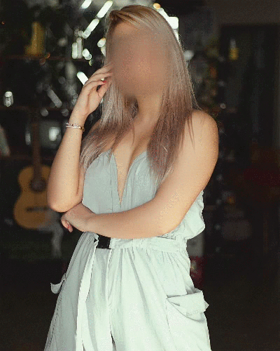
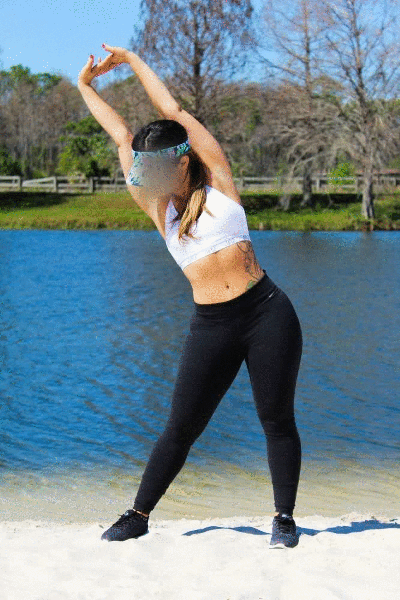
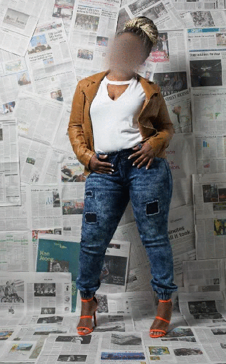

Structure-Aware Flow Generation for Human Body Reshaping
=====

[Jianqiang Ren](rjq235@gmail.com), Yuan Yao, Biwen Lei, Miaomiao Cui, Xuansong Xie 

[Paper](https://arxiv.org/abs/2203.04670) | [Demo Video](https://cloud.video.taobao.com/play/u/null/p/1/e/6/t/1/d/ud/350344036910.mp4)

## Overview
We propose a novel end-to-end structure-aware flow generation framework for human body reshaping, which can achieve favorable and controllable results for high-resolution images efficiently. The BR-5K is the first large-scale dataset for body reshaping, it consists of 5,000 high-quality individual portrait photos at 2K resolution collected from [Unsplash](https://unsplash.com/).

  

## BR5K Dataset
To be released soon.

Considering that the misuse of the dataset may lead to ethical concerns, as recommended by AC, we will review the application to access the datasets. To be able to download the BR5K database, please download, sign and return the [agreement form](https://raw.githubusercontent.com/JianqiangRen/FlowBasedBodyReshaping/main/EULA/EULA0310.pdf) to this e-mail address([jianqiang.rjq@alibaba-inc.com](jianqiang.rjq@alibaba-inc.com)).

 
## License
© Alibaba, 2022. For academic and non-commercial use only.
 
